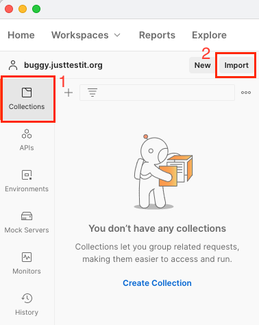
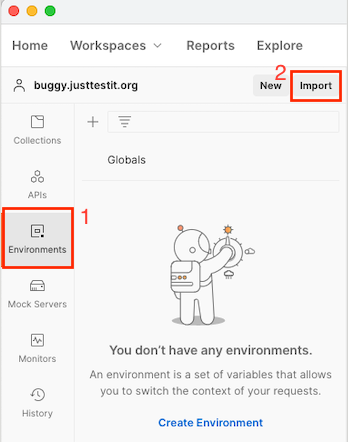
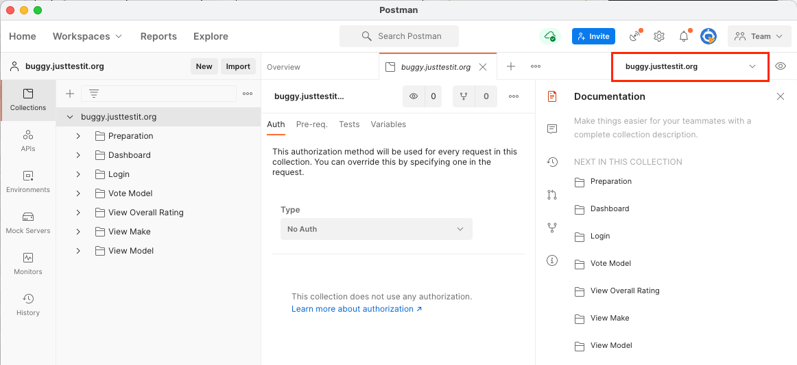
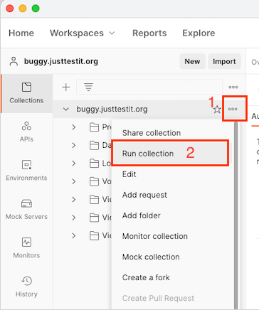
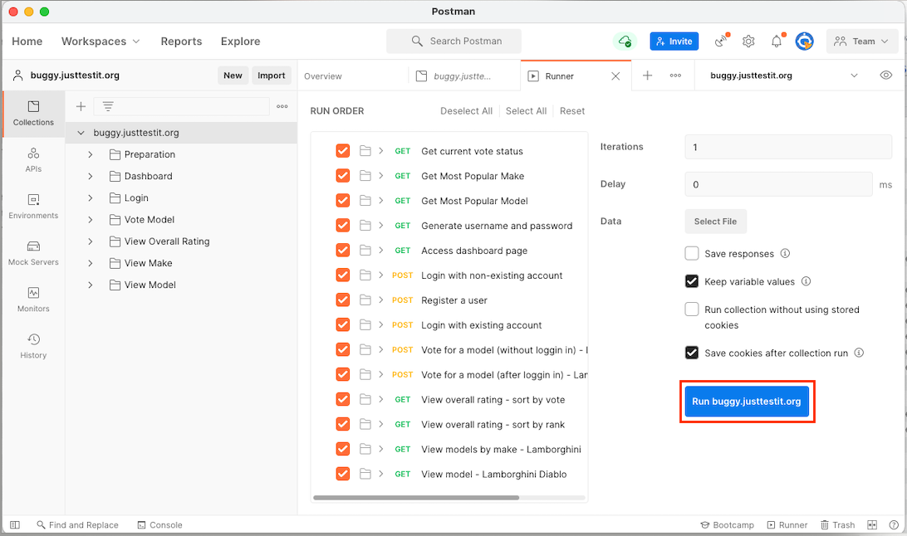
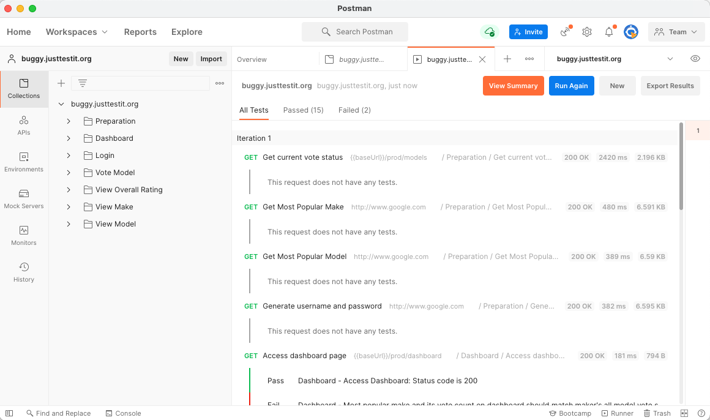

# Test Automation of buggy.justtestit.org

This project is to implement an approach to test the website buggy.justtestit.org. API testing is automated with Postman which provides running APIs with different parameters and validates the result with JavaScript functions.

* Links to other documents
   * [Test Approach](./documents/TestApproach.md)
   * [Issue List](./documents/IssueList.md)
   * [Test Result - Google Spreadsheet](https://docs.google.com/spreadsheets/d/1Q3gF7bouFEos2vCjT5rP6gCY0FsSpFSv0a8Cp8DL39M/edit?usp=sharing)
   
## Install

1. Install [npm](https://www.npmjs.com/package/npm)
2. Download the package and go to the folder
3. In the folder, run the following command
```
npm install
```
> On Windows, installing newman on global level is also required
```
npm install -g newman
```

## Running the test

### From the command line
```
newman run buggy.justtestit.org.postman_collection.json -e environment/buggy.justtestit.org.postman_environment.json
```

### From Postman app
1. Download Postman from [Postman website](https://www.postman.com/downloads/) and install
2. Import the test project file
   1. Open Postman, and select **Collection** tab. Then click **Import**  
   
   2. Click **Upload Files** and upload [buggy.justtestit.org.postman_collection.json](./buggy.justtestit.org.postman_collection.json) file
   3. Click **Import**. Now the test automation project is created as a collection.
2. Import the environment file
   1. Select **Environment** tab. Then click **Import**  
   
   2. Click **Upload Files** and upload [buggy.justtestit.org.postman_environment.json](./environment/buggy.justtestit.org.postman_environment.json) file
   3. Click **Import**. Now the environment is available in Postman
3. Run the test
   1. Set the environment **buggy.justtestit.org** on top-right corner  
   
   2. Go to **Collections** tab, then sele  
   
   3. Verify the run details (leave as default) and click **Run buggy.justtestit.org** button.  
   
   4. Verify test result  
   