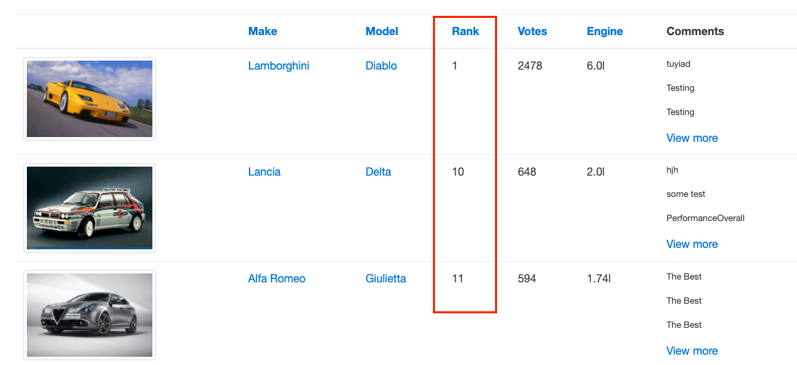

# Issue Report #2

## Sort by rank in Overall Rating is not sorted numerically

### Replication steps
1. From dashboard, drill down to Overall Rating page by clicking the image
2. On Overall Rating page, click "Rank"

### Expected result
* Models are sorted by Rank numerically from #1, #2, #3...

### Current result
* Models are sorted by Rank, but numbers are treated as string, so sorted #1, #10, #11, #2...  


### Further Investigation
When `prod/models` API is called with `orderBy=rank`, the result is sorted alphabetically, not numerically. There is a bug in the API implementation.

Return body snippet from `prod/models?orderBy=rank`
```
{
    "models": [
        {
            "name": "Diablo",
            "rank": 1,
        },
        {
            "name": "Delta",
            "rank": 10,
        },
        {
            "name": "Giulietta",
            "rank": 11,
        },...
```

### Test environment
* Chrome v92 on MacOS 11.5

[Back to issue list](./IssueList.md)